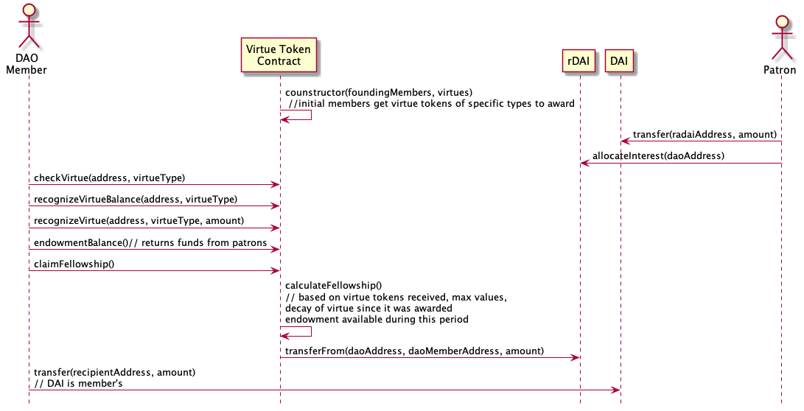

# Virtue DAO EnDAOments

A Decentralized Autonomous Organization (DAO) with no proposals. The Virtue DAO creates a virtuous swarm aligned with the mission. Members receive continuous EnDAOment funding based on their virtue.

## The Problem With DAO Proposals

Decentralized Autonomous Organizations (DAOs) help us fulfill a common purpose, allocate resources and coordinate activities.

**But** proposals take a long time to write, read and vote on. Voter turnout is often very low. Waiting for permission for proposals is not fast enough in fast moving scenarios or in large communities with lots of localized expertise and decisions. Proposals are not in the spirit of permissionless action and do-ocracy. 

## Virtuous Swarms With No Proposals

As a metaphor, consider a monastic order where individuals gain access to the resources of the order based on their adherence to following the precepts of their order - through their virtue. If the people of the order (monks, knights, artists, activists) remain true to the precepts others who are inspired by their actions and way of acting donate to the endowment.

Here are some example virtues, drawn from Agile Software Development, the Open Source ethos, Buddhist precepts and the code of chivalry: 
* Writes open source DAO governance code that is useful to the community
* Acts to support the welfare of other DAO members
* Abstains from false speech
* Perseveres to the end in any enterprise begun
* Uses funds granted from the Virtue DAO towards the DAOs mission

To get more utilitarian, many organizations have a mission, stated values and KPIs. These can be translated into "virtues".

## Use Cases 



### Patron Endows the DAO 

1. Likes the mission of the Virtue DAO and wants to support virtuous people and their projects to work towards the goal of the DAO  
2. Transfers funds in DAI to Compound to receive compound interest on loans
3. Delegates the interest from their DAI deposit to the Virtue Token Contract address using rDAI
4. When interest accrues it is allocated Virtuous members through the Virtue DAO

### DAO Proposal Endows a Virtue DAO

1. A good person submits a proposal to another DAO with funds, to fund the Virtue DAO
2. The proposal is accepted
3. The funding DAO transfers DAI to the Virtue DAO smart contract account 
4. The funds are dispersed to virtue DAO members in proportion to their virtue

### Member Gets a Dividend

1. Embodies the virtues of the Virtue DAO
2. Receives Virtue Tokens for their virtues
3. They claim their DAI based on the amount of virtue they have been recognized with
4. Time passes and their past Virtue Tokens decay
5. They receive new Virtue Tokens
6. They claim their DAI based on the amount of virtue they have been recognized with

### Member Recognizes Another Members Virtue by Awarding Virtue Tokens 

1. The foundingMember or person with virtue receives virtue tokens over time to award to other members
2. They award the tokens to other members who's virtue they recognize 

### The Virtue DAO Deployer Configures the Virtue DAO

1. Configures the projects mission and virtues
2. Configures the foundingMember blockchain addresses and the number of virtue tokens they receive
3. Deploys the virtue DAO contract

## User Virtue Calculations

Each user's virtue for the current period is calculated as:
```
virtue(user) = 
virtueAwards[ virtueTypes[0], time[t] ] * decay( time[t] ) +
virtueAwards[ virtueTypes[0], time[t - 1] ] * decay( time[t - 1] ) +
...
virtueAwards[ virtueTypes[n], time[t - i] ] * decay( time[t - i] ) 
```

To lower computation this is simplified by only storing the current virtue ratings and running a `decay(Users, Virtues)` function once and only once per period.

## Member Dividend Calculations

For the current period each member can withdraw:
```
fellowship(user) = (virtue(user) / totalVirtue) * currentEndowment
```

## Awardable Virtue Tokens Calculation

Each period, each member of the Virtue DAO receives an allocation of virtue tokens. They can award these generic virtue tokens to any person for a specific virtue established by the DAO.

When the DAO is deployed there is an `awardableByFounderAmount`. This is given to founders each period to make sure there are always some people who can continue to recognize virtue for the DAO.

Each users allocation of tokens for the given period is
```
baseAmount( user ) = if( user is founder ) then founderAllocation else 0

virtueTokenallocationThisPeriod(user) = 
baseAmount + ( (virtue(user) / maxVirtue) * maxAllocation )
```

## Initial Idea Bucket

* Resource allocation without proposals 
* Funds allocated and made available proportionate to how much a person embodies the virtues that the DAO values
* Funded with DAO grants and compound interest from loaning out deposits using compound (like a coop bank or endowment)
* Paid with a continuous stipend and access for the virtuous with a sustainable distribution of funds - to maintain continuity of virtue incentives
* Blockchain anchored reputation verifying who has virtues that support the values and mission of the DAO
* Monthly allocation of resources with the option to pool resources
* A fair method of sourcing virtue from DAO members or a third party like Kleros
* We will probably build on existing DAO codebase like *DAOStack*

## Communication

Message the core maintainer Noah on Telegram @noahthorp or open an GitHub issue.

## Thanks!

Thanks to:
* Noah Thorp for initial idea and code
* Megan Knab @ Veriledger for coming up with the word EnDAOment
* Pet3rPan from MetaCartel for the encouragement
* Real Crypto Cats for the Virtue DAO cat meme - Instagram [@realcryptocats](https://www.instagram.com/realcryptocats/)
* Harlan Wood for the ongoing dialog about Trust Graph