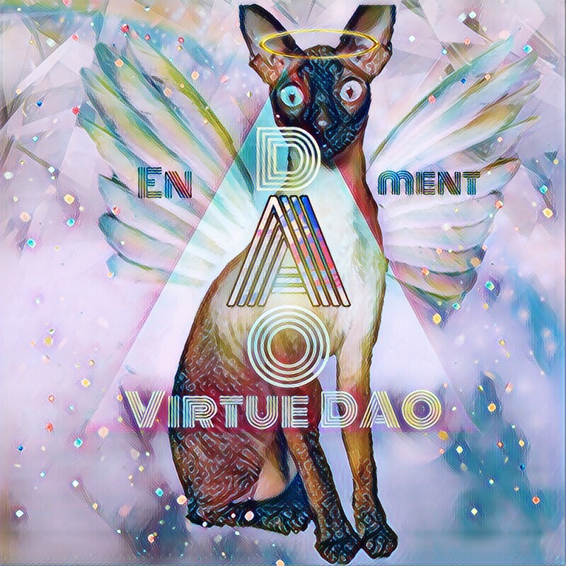
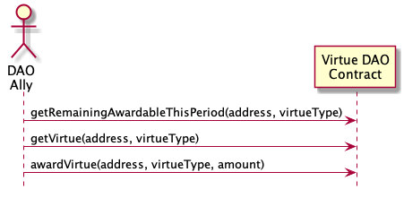
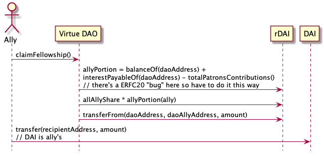
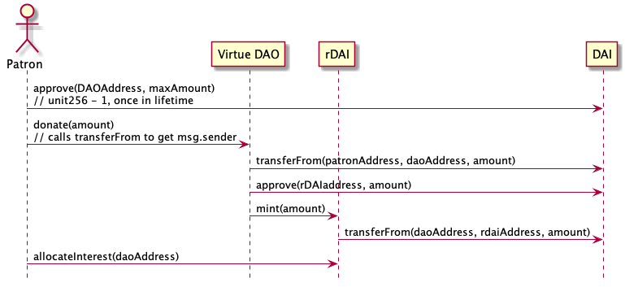
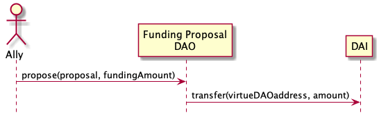
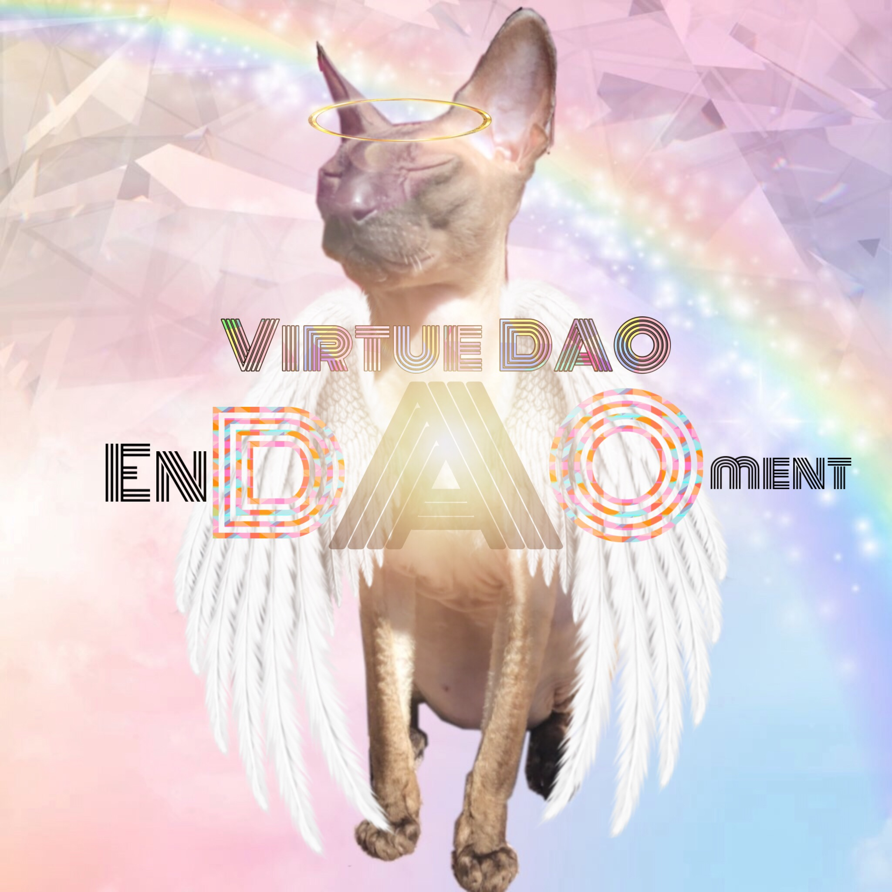

# Virtue DAO

The Virtue DAO is a new kind of decentralized autonomous organization that incentivizes virtuous swarm of autonomous agents aligned with the DAOs mission. Allies receive continuous EnDAOment funding based on their virtue. It's a Decentralized Autonomous Organization (DAO) with no proposals!

## STATUS: HACKATHON PROOF OF CONCEPT

Not suitable for funds you do not want to loose yet. Development and security audits needed.

## Technology

* Ethereum blockchain [solidity](https://solidity.readthedocs.io) smart contracts
* Javascript, [web3.js](https://web3js.readthedocs.io/en/v1.2.1/), node.js, [Truffle](www.trufflesuite.com)
* [MetaMask](https://metamask.io/) web wallet integration
* [Maker DAO, DAI](https://makerdao.com/en/dai/) stable coin backed by ETH but algorithmically pegged to USD value
* [Compound.finance](https://compound.finance) integration to allocate interest from the endowment fund 
* [rDAI](https://redeem.money) tokens wrap the Compound.finance cDAI for more flexible use
* Although Virtue DAOs stand on their own currently, they are complimentary to proposal based smart contract frameworks like [DAOstack](https://daostack.io) and [Aragon](https://aragon.org)

# Overview

## The Problem With DAO Proposals

Decentralized Autonomous Organizations (DAOs) help us fulfill a common purpose, allocate resources and coordinate activities.

**BUT** proposals take a long time to write, read and vote on. Voter turnout is often very low. Waiting for permission for proposals is not fast enough in fast moving scenarios or in large communities with lots of localized expertise and decisions. Although proposals have their place, they are not in the spirit of permissionless action and do-ocracy. 

## Virtuous Swarms of Agents With No Proposals

As a metaphor, consider a monastic order where individuals gain access to the resources of the monastic order based on adherence to the codified precepts. Monastic virtue and decentralized alignment towards a common mission are social algorithms. When the agents of an order (monks, knights, artists, activists) remain true to their mission and precepts, others who are inspired by their actions donate to the endowment. Mission and virtue based organizing has been critical in human history and its likely to remain so as long as there are humans in the loop. 

To get more utilitarian, many organizations have a mission, stated values and KPIs. These can be translated into the Virtue DAO framework. 

Here are some example "virtues" as we use them in the context of the Virtue DAO:
* Writes open source DAO governance code that is useful to DAO allies 
* Acts to support the welfare of other DAO allies
* Abstains from false speech
* Perseveres to the end in any enterprise begun
* Conscientiously uses funds granted from the Virtue DAO towards the DAOs mission

## The EnDAOment

To support the allies of the DAO, patrons can deposit funds using Compound.finance and rDAI. The underlying DAI stable coin is then lent out to borrowers. The interest from the loans is then used to fund the Virtue DAO allies on an ongoing basis. You can imagine this is similar to a credit union where the loan interest is dedicated to a social purpose.

In addition the Virtue DAO can take direct grants of DAI to be disbursed to allies directly.

# Virtue DAO Use Cases 

## Ally Recognizes Another Ally's Virtue by Awarding Them Virtue Points 

1. A initial ally or person with virtue receives virtue points over time to award to other allies
2. They award the points to other allies who's virtue they recognize 



## Ally Claims Fellowship In Proportion To Their Virtue

1. A person with a blockchain address embodies the virtues of the Virtue DAO
2. Someone at Virtue DAO sends them Virtue Points for their virtues and makes them a ally
3. The ally claims their DAI based on the amount of virtue they have been recognized with
4. Time passes and their past Virtue Points decay
5. They receive new Virtue Points
6. They claim their DAI based on the amount of virtue they have been recognized with



## Patron Endows the DAO 

1. Likes the mission of the Virtue DAO and wants to support virtuous people and their projects to work towards the goal of the DAO  
2. Transfers funds in DAI to Compound.finance via rDAI to receive compound interest on loans
3. Delegates the interest from their DAI deposit to the Virtue DAO Smart Contract address using rDAI
4. When interest accrues it is allocated Virtuous allies through the Virtue DAO



## DAO Proposal Endows a Virtue DAO

1. An ally submits a proposal to another DAO to fund the Virtue DAO
2. The proposal is accepted
3. The Funding DAO transfers DAI to the Virtue DAOs smart contract address 
4. The funds are dispersed to virtue DAO allies in proportion to their virtue




## The Virtue DAO Deployer Configures the Virtue DAO

1. The Virtue DAO deployer configures the projects mission and virtues
2. Configures the initialAlly blockchain addresses and the number of virtue points they receive
3. Deploys the virtue DAO contract

# Ally Virtue Calculations

## Virtue Decay Function

Each user's virtue for the current period is calculated as:
```
virtue(user) = 
virtueAwards[ virtueTypes[0], time[t] ] * decay( time[t] ) +
virtueAwards[ virtueTypes[0], time[t - 1] ] * decay( time[t - 1] ) +
...
virtueAwards[ virtueTypes[n], time[t - i] ] * decay( time[t - i] ) 
```

To lower computation this is simplified by only storing the current virtue ratings and running a `decay(Users, Virtues)` function once and only once per period.

## Ally Dividend Calculations

For the current period each ally can withdraw:
```
fellowship(user) = (virtue(user) / totalVirtue) * currentTotalFellowship 
```

## Awardable Virtue Points Calculation

Each period, each ally of the Virtue DAO receives an allocation of virtue points. They can award these generic virtue points to any person for a specific virtue established by the DAO.

When the DAO is deployed there is an `awardableByInitialAllyAmount`. This is given to initial allies each period to make sure there are always some people who can continue to recognize virtue for the DAO. This amount should be less than the awardable amounts people control in an active Virtue DAO.

Each users allocation of points for the given period is
```
baseAmount( user ) = if( user is an initial ally) then awardableByInitalAllyAmount else 0

virtuePointallocationThisPeriod(user) = 
baseAmount + ( (virtue(user) / maxVirtue) * maxAllocation )
```

# FAQs

## Why bother having a virtue points? Why not issued a stable coin directly?

The intent of the Virtue DAO is to continuously fund virtuous people achieving a mission. Virtue points are used to calculate the proportion of funds to allocate to each ally and to control how virtue decays over time. The decay of virtue is important for maintaining continuity, adapting to the changing activity of allies, and the ongoing incentive to adhere to the virtues of the DAO.

## Do you apply for membership to the Virtue DAO?

No. If you have virtue you are considered an agent of the DAO and can claim a portion of the continuous distribution of funds. You also can award other people virtue.

## Do you keep your points virtue forever?

No. Virtue decays gradually over time. You must keep being virtuous and aligned to receive benefits.

## How is Virtue initially distributed? What if no one has remaining virtue?

The initial agents can distribute some amount of virtue in every period, regardless of their current level of virtue. There may be a better solution to this, but we need to avoid locking funds because everyones virtue has decayed and no one should receive any points.

# Thanks!

* Megan Knab @ Veriledger for coming up with the word EnDAOment
* Pet3rPan from MetaCartel for the encouragement
* Miao for the rDAI integration coaching
* Real Crypto Cats for the Virtue DAO cat meme - Instagram [@realcryptocats](https://www.instagram.com/realcryptocats/)
* Harlan Wood for the ongoing dialog about Trust Graph

