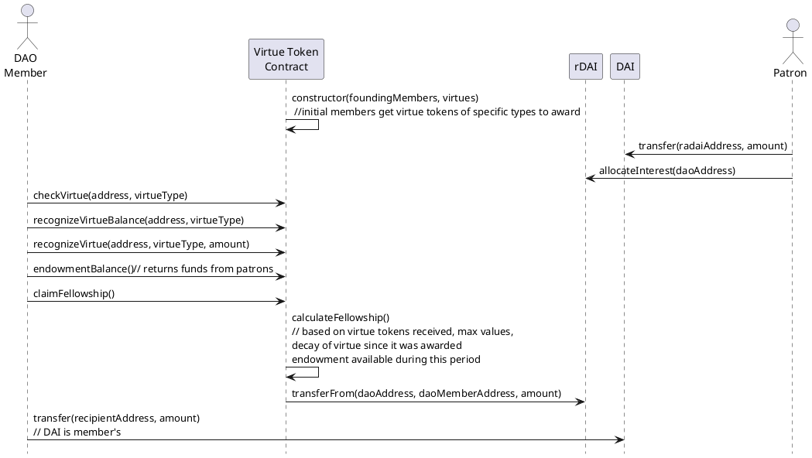

```plantuml
@startuml virtue-dao
hide footbox

actor Member1 as "DAO\nMember"
participant Virtue as "Virtue Token\nContract"
participant rDAI
participant DAI
actor Patron 
Virtue -> Virtue: constructor(foundingMembers, virtues) \n //initial members get virtue tokens of specific types to award
Patron -> DAI: transfer(radaiAddress, amount)
Patron -> rDAI: allocateInterest(daoAddress)

Member1 -> Virtue: checkVirtue(address, virtueType)
Member1 -> Virtue: recognizeVirtueBalance(address, virtueType)
Member1 -> Virtue: recognizeVirtue(address, virtueType, amount)
Member1 -> Virtue: endowmentBalance()// returns funds from patrons 
Member1 -> Virtue: claimFellowship()
Virtue -> Virtue: calculateFellowship()\n// based on virtue tokens received, max values,\ndecay of virtue since it was awarded\nendowment available during this period
Virtue -> rDAI: transferFrom(daoAddress, daoMemberAddress, amount)
Member1 -> DAI: transfer(recipientAddress, amount) \n// DAI is member's
@enduml
```