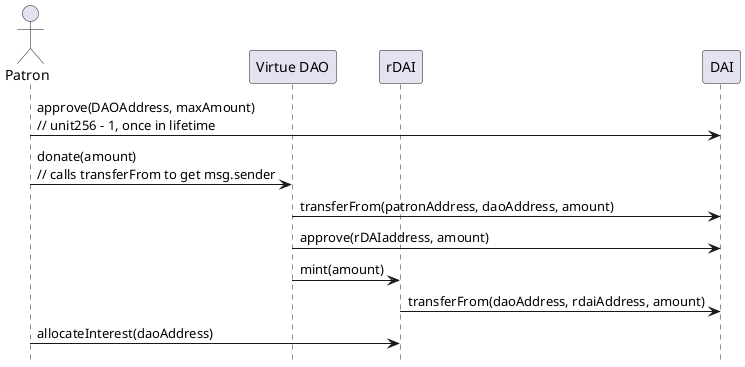
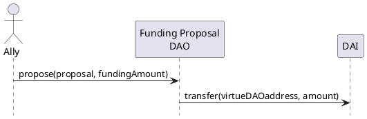
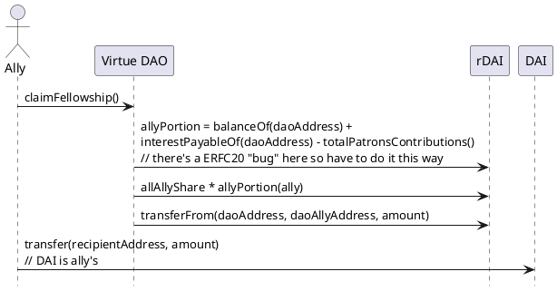
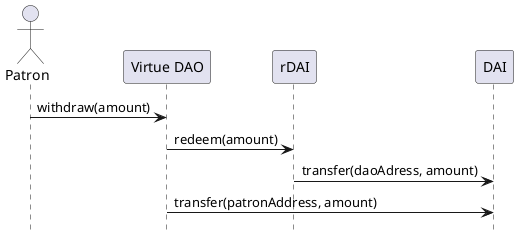
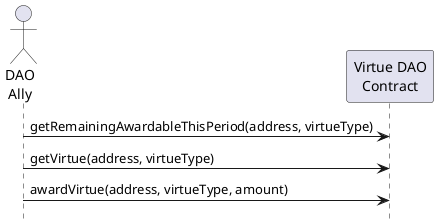

```plantuml
@startuml patron-endowment 
hide footbox

actor Patron 
participant DAO as "Virtue DAO"
participant rDAI
participant DAI
Patron -> DAI: approve(DAOAddress, maxAmount)\n// unit256 - 1, once in lifetime
Patron -> DAO: donate(amount)\n// calls transferFrom to get msg.sender
DAO -> DAI: transferFrom(patronAddress, daoAddress, amount)
DAO -> DAI: approve(rDAIaddress, amount)
DAO -> rDAI: mint(amount)
rDAI -> DAI: transferFrom(daoAddress, rdaiAddress, amount)
Patron -> rDAI: allocateInterest(daoAddress)
@enduml
```

```plantuml
@startuml dao-proposal-grant 
hide footbox

actor Ally
participant DAO2 as "Funding Proposal\nDAO"
participant DAI
Ally -> DAO2: propose(proposal, fundingAmount)
DAO2 -> DAI: transfer(virtueDAOaddress, amount)
@enduml
```

```plantuml
@startuml ally-funding
hide footbox

actor Ally1 as "Ally"
participant DAO as "Virtue DAO"
participant rDAI
participant DAI

Ally1 -> DAO: claimFellowship()
DAO -> rDAI: allyPortion = balanceOf(daoAddress) +\ninterestPayableOf(daoAddress) - totalPatronsContributions()\n// there's a ERFC20 "bug" here so have to do it this way
DAO-> rDAI: allAllyShare * allyPortion(ally)
DAO -> rDAI: transferFrom(daoAddress, daoAllyAddress, amount)
Ally1 -> DAI: transfer(recipientAddress, amount) \n// DAI is ally's
@enduml
```

```plantuml
@startuml patron-withdrawal
hide footbox

actor Patron 
participant DAO as "Virtue DAO"
participant rDAI
participant DAI

Patron -> DAO: withdraw(amount)
DAO -> rDAI: redeem(amount)
rDAI -> DAI: transfer(daoAdress, amount)
DAO -> DAI: transfer(patronAddress, amount)
@enduml
```

```plantuml
@startuml award-virtue 
hide footbox

actor Ally1 as "DAO\nAlly"
participant DAO as "Virtue DAO\nContract"
Ally1 -> DAO: getRemainingAwardableThisPeriod(address, virtueType)
Ally1 -> DAO: getVirtue(address, virtueType)
Ally1 -> DAO: awardVirtue(address, virtueType, amount)
@enduml
```